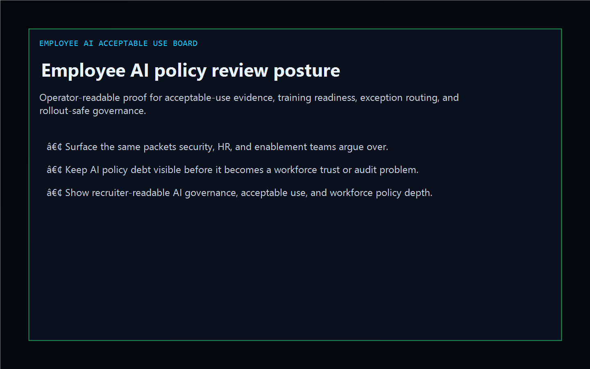
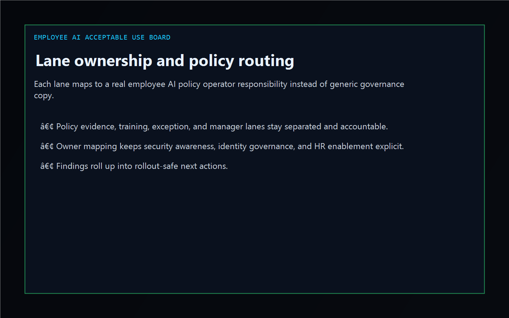
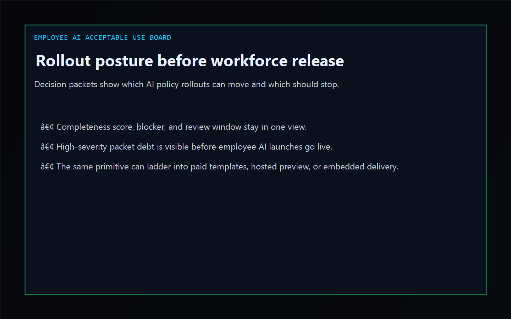

# Employee AI Acceptable Use Board

[](https://github.com/mizcausevic-dev/employee-ai-acceptable-use-board/actions/workflows/ci.yml)
[](https://github.com/mizcausevic-dev/employee-ai-acceptable-use-board/actions/workflows/pages.yml)
[](https://github.com/mizcausevic-dev/employee-ai-acceptable-use-board/releases/tag/v0.1-shipped)

TypeScript control plane for employee AI acceptable-use evidence, exception posture, training readiness, and review-safe rollout sequencing.

Live surface:

- [policy.kineticgain.com](https://policy.kineticgain.com/)

## Why this exists

- Employee AI rollouts often split policy language, exception handling, training proof, and manager escalation across security, legal, HR, and enablement teams.
- Enterprise shops still need one operator-readable picture before an AI policy, acceptable-use update, or employee disclosure checkpoint hardens.
- This surface turns synthetic policy, packet, and review exports into lane, gap, and rollout posture evidence without pretending to be a live policy-management tenant.

## Why this matters

This repo demonstrates the workforce AI-policy primitive for enterprise buyers: acceptable-use evidence tied to missing attestations, stale approvals, training blockers, and review-safe escalation paths. A B2B buyer would care because employee AI posture often needs to surface inside operator tools without exposing live employee records or write-heavy governance systems. Kinetic Gain Embedded extends this into security-first in-product analytics for review-aware and evidence-aware workflows, see [kineticgain.com/embedded](https://kineticgain.com/embedded).

## Monetization ladder

- Tier 1 now: public repo, dashboard, analyzer, and docs surface
- Tier 2 planned: paid policy templates, exception playbooks, and training-readiness checklists
- Tier 3 contingent: hosted preview when product rail and billing are ready
- Tier 4 by engagement: embedded AI-policy governance and evidence-routing delivery

## Surface map

- `/`
- `/policy-lane`
- `/exception-gaps`
- `/rollout-posture`
- `/verification`
- `/docs`

Structured APIs:

- `/api/dashboard/summary`
- `/api/policy-lane`
- `/api/exception-gaps`
- `/api/rollout-posture`
- `/api/verification`
- `/api/sample`

## Screenshots





## Local usage

```powershell
git clone https://github.com/mizcausevic-dev/employee-ai-acceptable-use-board.git
cd employee-ai-acceptable-use-board
npm install
npm run verify
npm run prerender
npm run render:assets
```

Start the local server:

```powershell
npm run dev
```

Useful routes:

- [http://127.0.0.1:5524/](http://127.0.0.1:5524/)
- [http://127.0.0.1:5524/policy-lane](http://127.0.0.1:5524/policy-lane)
- [http://127.0.0.1:5524/exception-gaps](http://127.0.0.1:5524/exception-gaps)

CLI example:

```powershell
npx employee-ai-policy-board fixtures/employee-ai-acceptable-use-clean.json --format summary
```

## Release discipline

| Guardrail | Posture |
| --- | --- |
| Data handling | Synthetic, non-employee, non-tenant-identifying policy and packet snapshots only. No live employee or tenant credentials. |
| Deploy | Static prerender -> **https://policy.kineticgain.com/** (GitHub Pages, [pages workflow](./.github/workflows/pages.yml)) |
| SEO | `robots.txt`, `sitemap.xml`, canonical routes, and crawlable docs included |
| Theme | Dark Kinetic Gain operator shell aligned to the current public dashboard standard |
| Tests | `npm run verify` covers lint, typecheck, vitest coverage, build, demo, and smoke |

## Platform note

This is an independent operator-surface demonstration for teams working with employee AI policy, acceptable-use review, and workforce governance workflows. It is not an official vendor site, SDK, or tenant integration.
